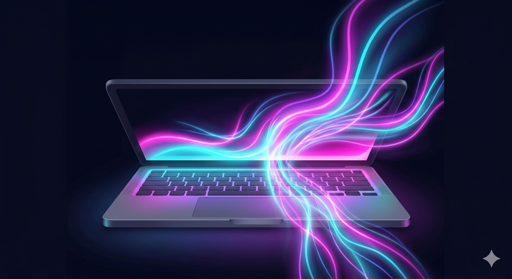

# Insomnia

<p align="center">
  
</p>

**Keep your Mac awake while an AI coding agent is working.**

When Claude Code, Codex, or Gemini CLI is grinding through a long autonomous
task, you can't just walk away — the Mac hits its idle-sleep timer and the task
halts mid-run. Insomnia is a tiny macOS menu bar app that holds a system
idle-sleep assertion **only while a followed agent is actively working** (plus a
short grace period after each turn), then lets the Mac sleep normally once the
agent goes idle.

The display is still allowed to sleep — so you can literally close your eyes and
go to bed while the work continues.

No API keys, no telemetry, nothing to configure. Open source under the MIT
license.

> Not affiliated with Kong's "Insomnia" API client — same word, different tool.

## How it works

```
agent CLI ──hook──▶ insomnia-hook ──writes──▶ session state files
                                                     │
                                              watcher + 10s timer
                                                     │
                                                     ▼
                                          Insomnia.app reconciles
                                                     │
                                          ┌──────────┴──────────┐
                                   IOKit power assertion   menu bar icon
```

Each agent's hook system runs the bundled `insomnia-hook` helper on session
events. The helper records one small JSON file per active session. The menu bar
app watches that directory, and a pure reconcile engine decides whether to hold
an IOKit `PreventUserIdleSystemSleep` assertion.

## Supported agents

| Agent | Integration | Config file |
|-------|-------------|-------------|
| **Claude Code** | hooks | `~/.claude/settings.json` |
| **Codex CLI** | `[hooks]` + `codex_hooks` feature | `~/.codex/config.toml` |
| **Gemini CLI** | hooks | `~/.gemini/settings.json` |

You pick which agents to follow in the Settings window (also shown on first
launch as a short onboarding). Insomnia installs and removes each integration
for you, and never clobbers your existing config — see
[docs/HOOKS.md](docs/HOOKS.md).

## Install

1. Download `Insomnia-<version>.zip` from the [Releases](../../releases) page and
   unzip it.
2. Move `Insomnia.app` to `/Applications`.
3. **First launch:** because the app isn't notarized, right-click it → **Open** →
   **Open**. You only do this once. See [docs/GATEKEEPER.md](docs/GATEKEEPER.md).
4. On first run, the Settings window opens so you can pick which agents to
   follow. You can change this anytime from the menu bar's **Settings…** item.
5. **Restart any running agent sessions** so they pick up the new hooks.

That's it — a `zzZ` indicator appears in your menu bar. It bumps to a heavier
weight when Insomnia is holding an awake assertion.

## Build from source

Requires the Xcode Command Line Tools and macOS 13+.

```sh
git clone <this-repo>
cd insomnia
swift build -c release        # build the executables
./Bundle/bundle.sh            # assemble dist/Insomnia.app (ad-hoc signed)
```

Run the tests with `swift test`, and the hook integration script with
`./scripts/test-hook.sh`. `./scripts/install-dev.sh` builds and copies the app
into `/Applications` for local testing.

## Usage

The menu bar item shows the current state and a small set of controls:

- **Header** — `Keeping Mac awake` or `Idle — Mac can sleep`, plus a line per
  active session.
- **Keep Awake Anyway** — force the Mac awake regardless of agent activity.
- **Settings…** — opens a one-page window for everything else: which agents to
  follow, grace period, AC-only mode, launch at login.

The Settings window is also what appears on first launch as a short
onboarding — pick your agents and you're done.

## Limitations

- **Closing a laptop lid still sleeps the Mac.** No app can override clamshell
  sleep. Insomnia only blocks the *idle* sleep timer; choosing Sleep from the
  Apple menu or pressing the power button also still works — by design.
- **The app must be running** to hold the assertion. It's a menu bar app — turn
  on *Launch at Login* and forget about it.
- **Unsigned in v1** — no Apple Developer notarization yet (see
  [docs/GATEKEEPER.md](docs/GATEKEEPER.md)).

## Disclaimer

Insomnia keeps your Mac awake — which means it **uses more power than letting it
sleep**, and on battery it will drain faster. It will not help your battery
life; if anything, expect the opposite. Turn on **Only on AC Power** if that
matters to you.

Insomnia is provided as-is, with no warranty of any kind — **use at your own
risk**. See [LICENSE](LICENSE).

## Uninstall

1. Open **Settings…** from the menu and uncheck each followed agent (removes
   the hooks), or run `insomnia-hook uninstall`.
2. Quit Insomnia and delete `Insomnia.app`.
3. Delete `~/Library/Application Support/Insomnia/` if you want to remove its
   state and config.

The original, pre-Insomnia copy of each agent config is kept beside it as
`<config>.insomnia.bak`.

## Roadmap

- Notarized, signed builds
- Homebrew tap (`brew install --cask insomnia`)
- Per-project allow/deny lists

## License

MIT — see [LICENSE](LICENSE).
